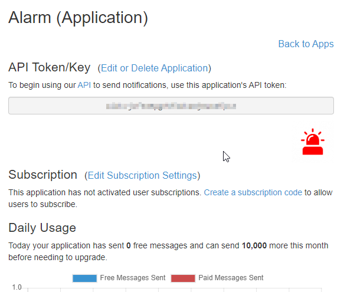
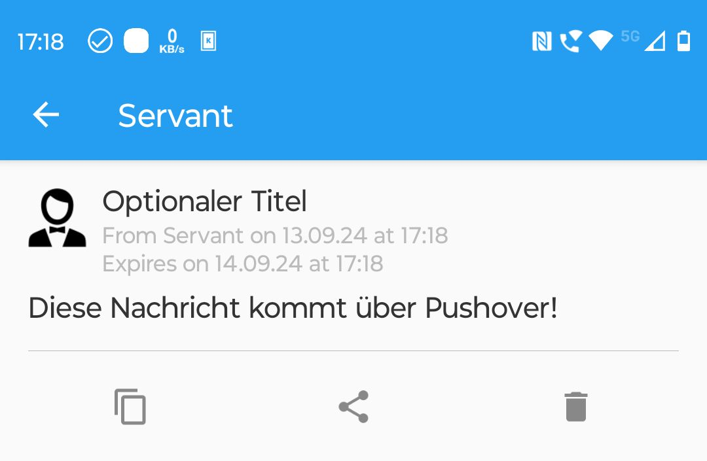

# Einfache Push-Benachrichtigungen mit Pushover

*Pushover* ist ein Webdienst, der über eine einfache Schnittstelle (*API*) die unkomplizierte Benachrichtigung mittels Push-Nachrichten auf Mobilgeräte ermöglicht. Es gibt Apps für Android und iOS.

## Preis

Der Dienst ist für Privat- und Einzelnutzer günstig: für jedes Endgerät wird nur [eine einmalige Zahlung von 5 USD](https://pushover.net/pricing) verlangt.

Es gibt noch einen größeren Tarif namens [Pushover for Teams](https://pushover.net/teams). Dieser kostet 5 USD pro Nutzer und Monat. Hier sind größere Nachrichtenlimits verfügbar und zentrale Verwaltungs- und Logging-Funktionen eingebaut.

Für die meisten Fälle dürfte jedoch der "kleine Preis" mit Einmalzahlung ausreichen.


## Grundsätzliches Vorgehen

- Konto anmelden
- Client installieren und im Konto registrieren
- Absendeadresse (*Application*) definieren
- über die API eine Nachricht senden

## Applications, die Absendeadressen

Jedes Nutzerkonto hat einen sog. *User Key*. Dieser könnte so aussehen: `qpnx2xgcpwwftfia574mgk3y6424e3`. Das ist die Adresse, **an** die eine Push-Nachricht gesendet wird. Die zu diesem Konto registrierten Endgeräte empfangen dann die Nachricht und zeigen diese an.

In einem Nutzerkonto können mehrere Absender definiert werden (genannt *Applications*). Es macht Sinn, z.B. für jeden Server oder für verschiedene Programme, die Push-Nachrichten absetzen sollen, jeweils einen eigenen Absender anzulegen.


Jeder Absender hat einen Namen, kann ein eigenes Logo bekommen (das beim Empfang einer Push-Nachricht auf dem Endgerät angezeigt wird) und hat sein eigenes monatliches Nachrichtenlimit.

Eine Application hat eine Kennung (den sog. *API Token*). Auch hier handelt es sich wie beim *User Key* um einen 30-stelligen alphanumerischen Schlüssel.



## API

Pushover bietet eine ganz einfache [API](/api/) an. Der eigene Dienst (z.B. ein Server) schickt einen HTTP-POST-Request an einen Endpunkt mit einigen wenigen Daten:

- `token` - das ist der API-Token der Application (der Absender)
- `user` - das ist der User-Token des eigenen Kontos (der Empfänger)
- `message` - die zu versendende Nachricht
- `title` - einen vorangestellten Titel (optional)
- `device` - der Name eines registrierten Endgeräts, wenn man nicht auf allen Endgeräten diese Nachricht empfangen möchten (optional)

Weitere mögliche **optionale** Datenfelder sind:

- `priority`
- `sound`
- `attachment`
- `ttl`

Der Endpunkt lautet: `https://api.pushover.net/1/messages.json`

### Priority

Das Feld Priority kann die Werte -2, -1, 0, 1, 2 annehmen, wobei 0 der Standardwert ist.

Je höher die Priorität, desto aufdringlicher die Benachrichtigung. Wenn also der eigene Server nicht mehr läuft, kann man mit der Priorität 2 sicherstellen, dass die Nachricht bewusst von Hand bestätigt werden muss.

Nachrichten mit Priorität -2 generieren überhaupt keine Benachrichtigung und lassen sich somit für die Zustellung von einfachen "Ereignis-Hinweisen" nutzen, die man vielleicht nur hin und wieder einsehen möchte.

### TTL (time-to-live)

Gerne nutze ich das optionale Feld `ttl`. Dieses steht für die Anzahl an Sekunden, nach denen die empfangene Nachricht gelöscht werden soll. Damit kann man sicherstellen, dass nicht übermäßig wichtige Nachrichten nach einer gewissen Zeit automatisch vom Endgerät entfernt werden. Gibt man als Inhalt von `ttl` den Wert `86400` an, dann verschwindet die Nachricht nach 24 Stunden.

### Beispiel (cURL)

Der einfachste Weg, einen HTTP-POST-Request abzusenden, ist das Werkzeug *cURL*. Dieses ist für die meisten Betriebssysteme verfügbar.

```bash
curl -s \
  --form-string "token=APP_TOKEN" \
  --form-string "user=USER_KEY" \
  --form-string "message=Diese Nachricht kommt über Pushover!" \
  --form-string "title=Optionaler Titel" \
  --form-string "ttl=86400" \
  --form-string "priority=-1" \
  https://api.pushover.net/1/messages.json
```

Diese Nachricht wird dann so auf dem Mobilgerät empfangen:



Den Namen *Servant* und das Logo kann man im Pushover-Dashboard für die jeweilige *Application* vergeben.


## Weitere Versandmöglichkeiten

Zusätzlich zum direkten Ansprechen der API gibt es viele Dienste, die die Integration der Pushover-API bereits von Haus aus mitbringen (z.B. IFTTT).

Eine alternative Möglichkeit ist das Anlegen von E-Mail-Adressen. Für jede Adresse kann einzeln definiert werden, an welche Endgeräte und mit welcher Priorität die Nachricht ausgeliefert werden soll. So lassen sich auch Workflows integrieren, die zwar Status-E-Mails versenden können, aber keine Skripte/Webaufrufe absetzen können. Oder man kann im eigenen E-Mail-Konto eine Regel einrichten, die besonders wichtige E-Mails an diese Pushover-E-Mail-Adresse weiterleitet.


## Verwendungsmöglichkeiten

Ich verwende Pushover-Benachrichtigungen immer dann, wenn ich mich von Servern/Diensten/Abläufen/Programmen über Probleme oder unregelmäßige Schritte bzw. Schritte mit unklarer Dauer benachrichtigen lassen möchte.

Beispielsweise sendet mir die [Github-Action](/misc/github-actions/), die [nach dem Verfassen neuer Beiträge](/info/#zur-technik-dieser-website) zu dieser Website von [Github](/misc/github/) automatisch ausgeführt wird, am Ende einen kurzen Statusbericht per Pushover. So weiß ich, dass die neue Version dieser Website online ist.

Eine weitere Möglichkeit sind lang laufende Datenbank-Jobs (im Rahmen einer Datenbank-Wartung). Hier weiß ich im Vorfeld nicht, wie lange diese laufen werden. Damit ich aber nach Abschluss eines solches Jobs kurzfristig wieder auf den Server schauen kann, lasse ich mich benachrichtigen.

## User und Token

Noch ein Hinweis zum Zusammenhang von eigenen Pushover-Konto (*User-Key*) und der absendenden Application (*API-Token*):

Oben habe ich dargestellt, dass man **immer** von *eigenen* Applications **zum** *eigenen* Empfänger sendet. Das dürfte auch der Normalfall sein. Es ist jedoch problemlos möglich, eine Nachricht auch an den einen *anderen* Benutzer zu senden. Dafür benötigt man lediglich den User-Key dieses Benutzers.


## Weitere Informationen

- [Pushover-Website](https://pushover.net)
- [Informationen zur API](https://pushover.net/api)
- [Go wrapper for the Pushover API](https://github.com/gregdel/pushover)
- [Pushover-Benachrichtigung mit Ninox senden](/ninox/pushover-benachrichtigung-mit-ninox-senden/)
- [Pushover für Android](https://pushover.net/clients/android)
- [Pushover für iOS](https://pushover.net/clients/ios)


{{ feedback(page.meta.title, page.meta.section, page.meta.slug) }}
