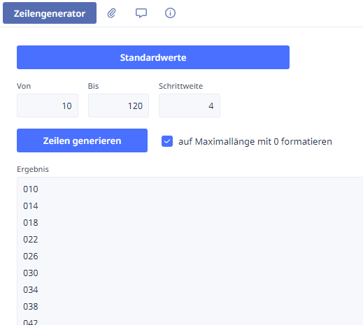

## Hintergrund

In fast jeder Programmiersprache gibt es irgendwie die Möglichkeit, fortlaufende Reihen von Zahlwerten generieren zu lassen (1, 2, 3, 4, 5, ....). Auch in Ninox gibt es mit der Funktion `range` eine solche Möglichkeit. Nachfolgend wird gezeigt, wie man das in einer Ninox-Datenbank konkret nutzen kann.

Ein möglicher **Einsatzzweck** wäre zum Beispiel das dynamische Erzeugen einer CSV-Datei, bei der man die exportierten Zeilen gezielt durchnumerieren möchte.

## Ergebnis

Das Ergebnis wird am Ende so aussehen:



Der Zeilengenerator lässt sich über die drei Eingabefelder und die Checkbox "auf Maximallänge mit 0 formatieren" einstellen.

Die Werte für "Von", "Bis" und "Schrittweite" entsprechen dabei den drei Parametern der Ninox-Funktion `range` (sh. [Dokumentation zur range-Funktion](https://docs.ninox.com/en/script/functions/range)).

Die Checkbox "auf Maximallänge mit 0 formatieren" steuert dabei das Aussehen der erzeugten Nummern. Wenn beispielsweise die Nummern von 1 bis 20 erzeugt werden sollen, dann sind die Zahlen ab 10 zweistellig. Also möchte ich diejenigen Werte, die weniger Stellen haben, (optional) mit führenden Nullen auffüllen (sh. Screenshot).

Der Button *Standardwerte* setzt die Parameter wieder zurück:

- Von = 1
- Bis = 10
- Schrittweite = 1
- "auf Maximallänge mit 0 formatieren" ausgeschaltet

## Umsetzung

Zuerst werden die drei Parameter Von, Bis und Schrittweite aus den Feldern des Formulars (genauer: des aktuellen Datensatzes der darunterliegenden Tabelle) in Variablen eingelesen. Außerdem wird für das Endergebnis eine Variable angelegt.

```javascript
let vonWert := Von;
let bisWert := Bis + 1;
let schrittweite := Schrittweite;
let zeilen := "";
```

An dieser Stelle könnte man jetzt auch noch Prüfungen einbauen, wenn der Benutzer unsinnige oder ungewollte Werte eingibt.

Die Funktion `range` gibt eine Liste (Array) zurück. Da ich das Ergebnis (wenn auch nur für Demonstrationsgründe) zeilenweise in einem Textfeld anzeigen möchte, *iteriere* ich über die einzelnen Werte der Ergebnisliste. Jeder einzelne Wert wird dann an die Ergebnisvariable `zeilen` angefügt. Am Ende wird der Inhalt dieser Variable in das Multiline-Textfeld *Ergebnis* geschrieben:


```javascript
for i in range(vonWert, bisWert, schrittweite) do
    zeilen := zeilen + i + NL()
end;
Ergebnis := zeilen
```

### Hinweis zu Zeilenumbrüchen

Ich verwende im Skript eine Funktion `NL()`. Diese gibt einen Zeilenumbruch zurück und führt dazu, dass der Ergebnistext im Textfeld jede Zahl in einer eigenen Zeile darstellt.

Da eine solche Funktion immer mal wieder gebraucht wird, bietet es sich an, diese als [globale Funktion](../globale-funktionen/#globale-funktion-fur-newline-zeilenumbruch) anzulegen. Wer das nicht möchte, kann die Funktion aber auch ganz einfach direkt zu Beginn des Skriptes einfügen. Sie ist dann nur im aktuellen Skript verfügbar:

```javascript
function NL() do
    "
"
end;
let vonWert := Von;
let bisWert := Bis + 1;
...
```

### Formatierung mit führenden Nullen

Was hat es jetzt mit der Formatierung und der Checkbox "auf Maximallänge mit 0 formatieren" auf sich? Wie schon beschrieben, werden Zahlen, die weniger Stellen haben als die größte Zahl im Zahlenbereich, mit führenden Nullen auf die Länge der größten Zahl aufgefüllt (sog. *Padding*).

Dazu wird die Länge der größten Zahl - das ist die im Textfeld *Bis* - ermittelt. Da die Ninox-Funktion `length` nur mit Strings umgehen kann, muss man die Zahl mit der Funktion `text` in einen String umwandeln.

```javascript
let maxLength := length(text(bisWert));
```

Um die Formatierung der Zahlen etwas übersichtlicher zu gestalten, habe ich diese in eine eigene Funktion ausgelagert. Diese Funktion übernimmt die jeweilige Zahl sowie die oben ermittelte Länge (Anzahl an Stellen) der größten Zahl (bei 100 bspw. eben "3").

Um einen Zahlenwert zu formatieren gibt es die Funktion `format`. Dieser übergibt man den Zahlenwert und einen Formatstring. Im Beispiel wäre dieser "000" - d.h. Zahlen werden auf 3 Stellen mit führenden Nullen aufgefüllt.

Da es in Ninox keine `repeat`-Funktion gibt, gibt es keine Möglichkeit, diesen Formatstring *richtig* dynamisch zu erzeugen. Ich behelfe mir damit, indem ich aus einem langen String mit vielen Nullen die notwendige Anzahl an Nullen *ausschneide* und diesen Substring an die `format`-Funktion übergebe.

```javascript
function formatNumber(theNumber : number,maxLength : number) do
    let formatString := substr("0000000000", 0, maxLength);
    format(theNumber, formatString)
end;
```

In der Schleife wird dann nicht wie vorher nur die ermittelte Zahl ausgegeben, sondern der Rückgabewert der Formatierungsfunktion.

```javascript
for i in range(vonWert, bisWert, schrittweite) do
    zeilen := zeilen + formatNumber(i, maxLength) + NL()
end;
```

Abschließend wollen wir noch steuern, dass die Formatierung der Zahlen nur erfolgen soll, wenn die Checkbox gesetzt ist. Wir haben bereits die Länge der größten Zahl ermittelt. Wenn die Checkbox jetzt *nicht* gesetzt ist, dann wird diese Länge wieder auf "0" korrigiert.

```javascript
let maxLength := length(text(bisWert));
if 'auf Maximallänge mit 0 formatieren' = false then
    maxLength := 0
end;
```

Alles weitere macht dann die Formatierungsfunktion `formatNumber` - oder eben gerade nicht. Es wird dann aus dem String mit den vielen Nullen ein Substring der Länge "0" ausgeschnitten - das resultiert in einem leeren Formatstring. Und die `format`-Funktion gibt bei einem leeren Formatstring exakt die Zahl so zurück, wie man sie übergeben hat. Das heißt: ist die Checkbox nicht gesetzt, werden nur die reinen Zahlenwerte zeilenweise ausgegeben.


{{ feedback(page.meta.title, page.meta.section, page.meta.slug) }}

